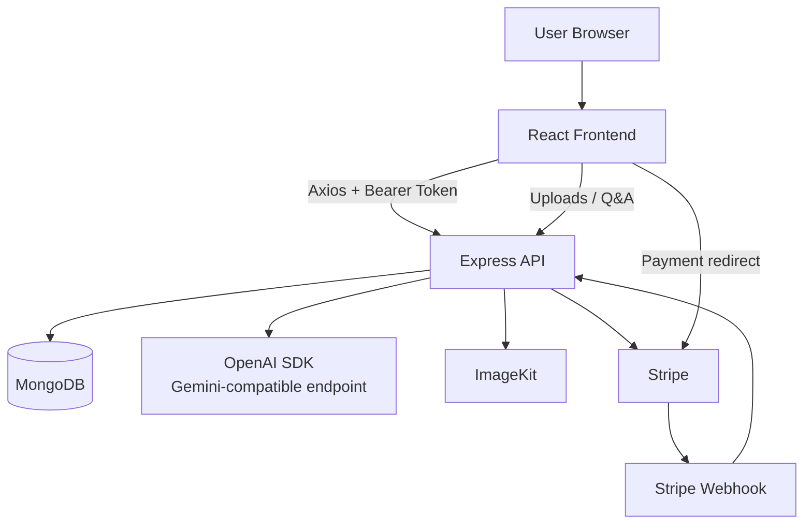
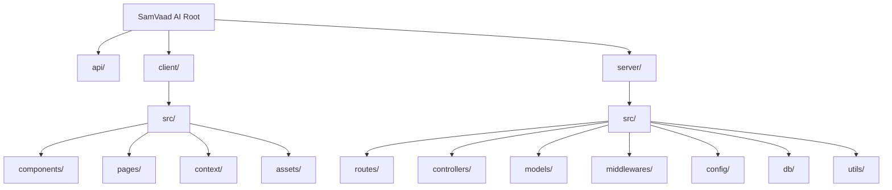
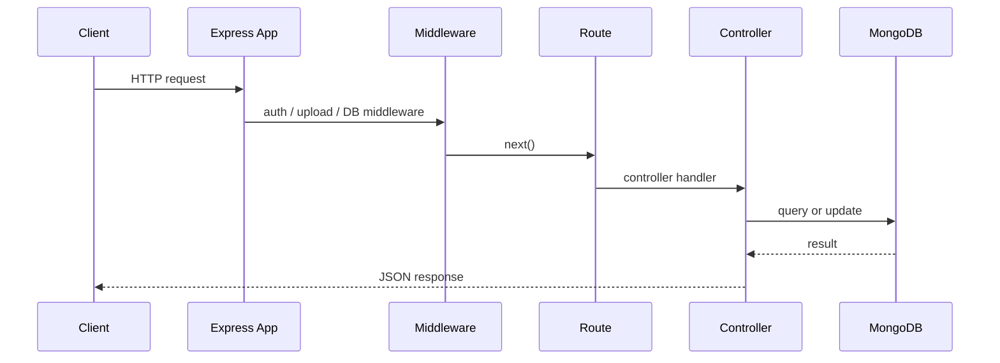
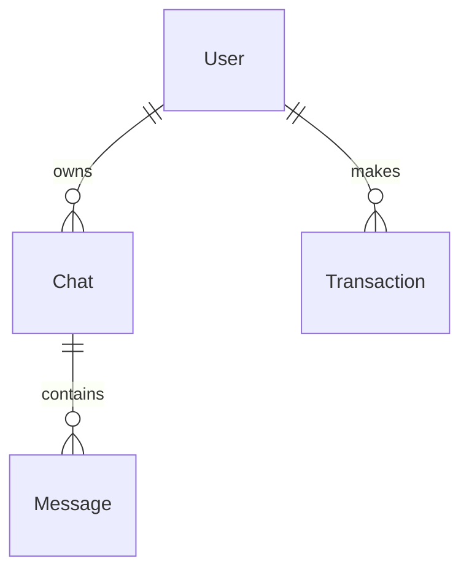
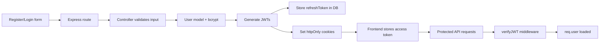
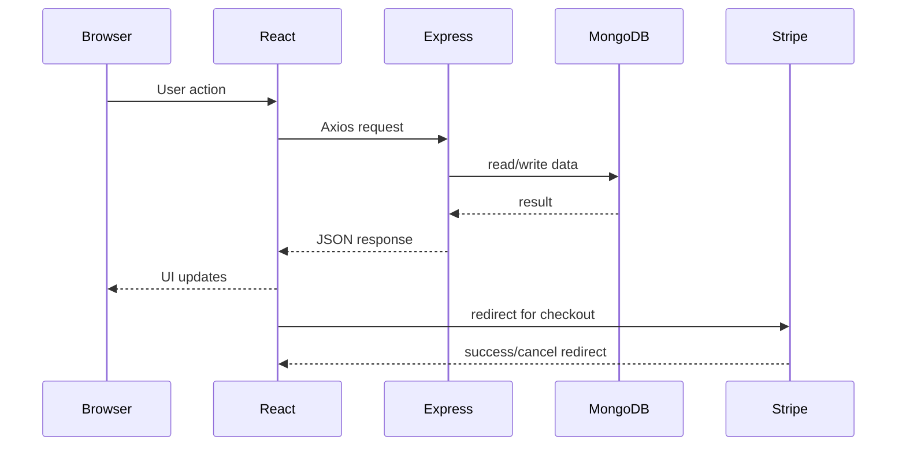

# SamVaad AI — Interview Preparation Handbook

> **Scope:** This document is based only on the actual code in this repository. If a behavior is not explicitly present, it is marked as **inferred** or noted as **not implemented**.

---

# 1. Project Overview

## Project Name
- **SamVaad AI**

## Purpose of the project
- A **full-stack AI chat application** that lets authenticated users:
  - chat with AI in text mode
  - generate AI images
  - ask questions about a website URL
  - ask questions about uploaded documents/images
  - manage chats
  - publish generated images to a community page
  - buy credits through **Stripe** after admin approval

## Problem statement
- Many AI apps are scattered across multiple tools.
- This project brings **chat, image generation, document Q&A, website Q&A, community sharing, and credit-based monetization** into one application.

## Target users
- People who want an AI assistant for everyday use
- Users who want image generation
- Users who want website/document Q&A
- Community users who want to share generated images
- Admin users who can approve booking access and manage package visibility

## Main features
- **Authentication** with register/login/logout/refresh token flow
- **Chat management**: create, fetch, rename, delete chats
- **Text chat with AI**
- **Image generation** with optional publishing to community
- **Website Q&A** using a URL and scraped page text
- **Upload Q&A** for images and documents
- **Community page** for published images
- **Credit system** with hardcoded plans
- **Stripe checkout + webhook verification**
- **Session-based active chat persistence** in frontend
- **Chat edit/regenerate flow**

## Why this project was built
- To build a practical **AI SaaS-style MERN project** with real interview-worthy features:
  - authentication
  - authorization
  - payment flow
  - file uploads
  - AI integration
  - community sharing
  - deployment support

## Real-world use cases
- Customer support assistant
- AI brainstorming/chat tool
- Prompt-based image generation
- Website summarization / page Q&A
- PDF/document analysis
- Sharing AI-generated images in a public gallery
- Credit-based SaaS monetization

## Technologies used
- **Frontend:** React 19, Vite, Tailwind CSS 4, React Router, Axios, React Hot Toast, React Markdown, PrismJS, Moment
- **Backend:** Node.js, Express 5, MongoDB, Mongoose, JWT, bcryptjs, Multer, CORS, Cookie parsing, Stripe, OpenAI SDK, ImageKit, Axios, Mammoth, pdf-parse, Svix
- **Deployment:** Vercel configuration is present for root, API entrypoint, and server

## Overall architecture
- **React frontend** talks to **Express backend** using Axios
- Backend stores users/chats/transactions in **MongoDB**
- AI responses are generated through the **OpenAI SDK** using a **Gemini-compatible endpoint**
- Generated/uploaded media is stored using **ImageKit**
- Purchases use **Stripe Checkout** and are verified using **Stripe webhooks**
- JWT auth uses **access + refresh token cookies** plus bearer token support

### Project architecture diagram


### Summary
- SamVaad AI is a **MERN-style AI chat SaaS** with payments and media workflows.

### Key Points
- Auth, chats, AI features, community publishing, and credits are all implemented.
- Payments are gated by admin approval.
- The project is backed by MongoDB and deployed with Vercel support.

### Revision Notes
- Say “**AI chat application with credit-based monetization**” in interviews.
- Mention the app uses **Gemini via OpenAI SDK** and **ImageKit** for media.

### Possible follow-up questions
- Why did you choose a credit-based model?
- How does the app support multiple AI modes?
- How is this project different from a simple chatbot?

---

# 2. Tech Stack

## Frontend technologies

| Technology | Why it was chosen | Alternatives | Why it is better here | Advantages | Limitations |
|---|---|---|---|---|---|
| **React 19** | Component-based UI, fast development | Vue, Angular, Svelte | Fits chat UI and state-driven rendering | Reusable components, hooks, ecosystem | Needs careful state management |
| **Vite** | Fast dev server and build | CRA, Webpack | Lightweight and modern | Fast HMR, simple config | Less “batteries included” than frameworks |
| **Tailwind CSS 4** | Utility-first styling | Bootstrap, CSS Modules, plain CSS | Fast UI iteration and theme support | Highly customizable, low CSS overhead | HTML can become class-heavy |
| **React Router DOM 7** | Client-side routing | Next.js routing, Reach Router | Works well for SPA routes | Declarative routing, nested routes | Not SSR by default |
| **Axios** | HTTP requests with interceptors/options | fetch | Easier request config and cookies | Cleaner API, request/response handling | Extra dependency over fetch |
| **React Hot Toast** | Non-blocking UI notifications | SweetAlert, custom toast | Simple UX feedback | Very easy to use | Less customizable than a full UI kit |
| **React Markdown** | Render AI replies safely as markdown | markdown-it, custom parser | Good for chat answers | Markdown support, easy integration | Needs sanitization awareness |
| **PrismJS** | Syntax highlighting in code blocks | Highlight.js | Better code display in chat | Beautiful code formatting | Extra client bundle size |
| **Moment** | Relative timestamps like “2 minutes ago” | dayjs, date-fns | Easy read-time formatting | Convenient API | Heavier and older than modern alternatives |
| **@tailwindcss/vite** | Tailwind integration with Vite | PostCSS config | Simpler setup | Faster build integration | Tailwind-specific |

## Backend technologies

| Technology | Why it was chosen | Alternatives | Why it is better here | Advantages | Limitations |
|---|---|---|---|---|---|
| **Node.js** | JavaScript on both frontend and backend | Python, Go | Shared language across stack | Fast I/O, huge ecosystem | CPU-heavy work is not ideal |
| **Express 5** | Minimal API framework | Fastify, NestJS | Lightweight REST API setup | Flexible middleware chain | Less opinionated than NestJS |
| **MongoDB** | Flexible document storage | PostgreSQL, MySQL | Good for chat/document-like data | Schema flexibility, fast iteration | Complex joins are harder |
| **Mongoose** | Schema + model abstraction | Native MongoDB driver | Better validation and methods | Middleware, schemas, helpers | Adds abstraction layer |
| **JWT** | Stateless authentication | Sessions, OAuth-only auth | Works well with API + cookies | Scalable, token-based | Must handle expiration carefully |
| **bcryptjs** | Password hashing | bcrypt, argon2 | Available in JS ecosystem | Strong hashing, salted passwords | Slower than plain comparison |
| **cookie-parser** | Read cookies in Express | Manual parsing | Needed for refresh/access cookies | Simple middleware | Must handle secure settings correctly |
| **CORS** | Cross-origin requests | Proxy-only approach | Needed for frontend/backend split | Flexible origin control | Misconfiguration can break auth |
| **Multer** | Multipart form parsing | Busboy, formidable | Handles file uploads | Simple upload middleware | Requires size/type validation |
| **ImageKit** | Store and serve images/files | Cloudinary, S3 | Used directly in codebase | Upload + CDN-like delivery | External service dependency |
| **Stripe** | Subscription/payment flow | Razorpay, PayPal | Checkout + webhook integration | Secure payment flow | Webhook and idempotency complexity |
| **OpenAI SDK** | AI text/vision calls | Native HTTP calls | Convenient completion API | Simple integration | Provider-specific API shape |
| **Mammoth** | Extract DOCX text | docx-parser | Used for document Q&A | Good for Word docs | DOCX only, not all formats |
| **pdf-parse** | Extract PDF text | pdf.js | Used for document Q&A | Good for readable PDF text | PDF quality varies |
| **Axios** (server) | Website fetch and AI/image requests | fetch | Easy timeout/error handling | Better HTTP config | Extra dependency |
| **Svix** | Present in package.json | — | Not observed in code paths | Webhook-related utility | Appears unused in current code |

## Other packages in package.json

### Root package
- `axios` — present at root; frontend/backend code both use Axios
- `bcryptjs` — password hashing in backend
- `cookie-parser` — Express cookie parsing
- `cookieparser` — duplicate package name; **not observed in code** and likely unused
- `cors` — Cross-Origin Resource Sharing
- `dotenv` — environment variable loading
- `express` — API server
- `imagekit` — media storage/upload
- `jsonwebtoken` — JWT creation/verification
- `mammoth` — DOCX text extraction
- `mongoose` — MongoDB ODM
- `multer` — multipart file handling
- `openai` — AI client SDK
- `pdf-parse` — PDF text extraction
- `stripe` — payments
- `svix` — present but not observed in code
- `nodemon` — development server reloads

### Client package
- `@tailwindcss/vite` — Tailwind integration with Vite
- `axios` — API requests
- `markdown` — present in package.json; **not clearly used** in the inspected React code
- `moment` — relative time formatting
- `prismjs` — code syntax highlighting
- `react` — UI library
- `react-dom` — DOM rendering
- `react-hot-toast` — notifications
- `react-markdown` — render AI markdown replies
- `react-router-dom` — routing
- `tailwindcss` — styling
- Dev tools: ESLint, Vite, React hooks plugin, React refresh plugin, Babel React compiler, TypeScript types

### Summary
- The real stack is **React + Express + MongoDB + JWT + Stripe + ImageKit + OpenAI SDK**.

### Key Points
- `bcryptjs` is used, not `bcrypt`.
- `Redux`, `Socket.io`, `Nodemailer`, and `Cloudinary` are **not used in the actual code**.
- `Svix` and `cookieparser` appear in dependencies but are not clearly used.

### Revision Notes
- In interviews, emphasize **why each package exists** and whether it is used in the current implementation.

### Possible follow-up questions
- Why did you choose Mongoose over the native driver?
- Why use Axios instead of fetch?
- Why is JWT combined with cookies here?

---

# 3. Folder Structure

## Root folder
- `package.json` — root dependencies and server start scripts
- `vercel.json` — root deployment rewrite to `/api/index.js`
- `.env` — actual environment values used by the project
- `.env.example` — sample env values for setup
- `api/` — serverless entrypoint for Vercel
- `client/` — React frontend
- `server/` — Express backend source and serverless config

## `api/`
- `index.js` — exports the Express app for serverless deployment
- Why it exists:
  - Vercel expects an API entrypoint in the `/api` directory

## `client/`
- React frontend application
- Why it exists:
  - Separate UI build and client-side routing

### `client/src/`
- Main React source folder
- Why it exists:
  - Keeps app logic, components, pages, and context organized

### `client/src/components/`
- Reusable UI pieces such as sidebar, chat box, message bubble, footer
- Why it exists:
  - Avoids duplication and improves maintainability

### `client/src/pages/`
- Page-level screens: login, loading, credits, community
- Why it exists:
  - Represents route-level views

### `client/src/context/`
- Shared app state and API helpers
- Why it exists:
  - Centralizes user, auth, chats, theme, and actions

### `client/src/assets/`
- Static assets, icons, dummy data, prism styles
- Why it exists:
  - Keeps UI resources separate from logic

### `client/public/`
- Static public assets (currently not much visible in the listing)
- Why it exists:
  - For directly served files

## `server/`
- Backend source code
- Why it exists:
  - Handles auth, chats, AI calls, payments, uploads, and database operations

### `server/src/`
- Core backend source

### `server/src/routes/`
- Express route definitions
- Why it exists:
  - Maps URLs to controllers cleanly

### `server/src/controllers/`
- Business logic for each route group
- Why it exists:
  - Keeps route files small and readable

### `server/src/models/`
- Mongoose schemas and model methods
- Why it exists:
  - Defines database structure and validation

### `server/src/middlewares/`
- Authentication, file parsing, request preprocessing
- Why it exists:
  - Reusable request-level logic

### `server/src/config/`
- Third-party client setup
- Why it exists:
  - Centralizes OpenAI and ImageKit configuration

### `server/src/db/`
- MongoDB connection logic
- Why it exists:
  - Keeps database setup in one place

### `server/utils/`
- Shared utility classes/functions
- Why it exists:
  - Standardizes async handlers, API responses, and errors

## Folder structure diagram


### Summary
- The folder structure cleanly separates **frontend, backend, shared utilities, and deployment entrypoints**.

### Key Points
- `api/index.js` is for Vercel.
- `server/src/server.js` is for local Node execution.
- Frontend logic is centered around `context/` and `components/`.

### Revision Notes
- When explaining structure, say: “**routes handle URLs, controllers handle business logic, models handle data, middlewares handle request preprocessing**.”

### Possible follow-up questions
- Why separate `controllers` from `routes`?
- Why is context used instead of prop drilling?
- What is the role of `api/index.js`?

---

# 4. Backend Explanation

## Core backend files

### `server/src/app.js`
- **Purpose:** Main Express app setup
- **Why it exists:** Defines middleware, routes, and error handling in one place
- **Connections:** Imports routers, DB connection, webhook controller, middleware
- **Functions / flow:**
  - sets up CORS
  - mounts health route
  - ensures DB connection before most requests
  - mounts Stripe webhook with raw body parsing
  - parses JSON, URL-encoded bodies, cookies
  - serves static files
  - mounts API routes
  - returns 404 on unknown routes
  - handles errors globally
- **Express request flow:** request → CORS → health shortcut or DB middleware → route → controller → error handler if needed

### `server/src/server.js`
- **Purpose:** Local server entrypoint
- **Why it exists:** Starts Express on `PORT` after connecting to MongoDB
- **Connections:** imports `connectDB` and `app`
- **Execution flow:** load env → connect DB → `app.listen(...)`

### `api/index.js`
- **Purpose:** Serverless/Vercel entrypoint
- **Why it exists:** Exports the Express app for deployment
- **Connections:** imports app from `server/src/app.js`

### `server/src/constants.js`
- **Purpose:** Defines database name
- **Why it exists:** Keeps DB name centralized
- **Value:** `DB_NAME = "SAMVAAD_AI"`

## Database and config files

### `server/src/db/index.js`
- **Purpose:** MongoDB connection helper
- **Why it exists:** Reuses a cached connection promise for serverless efficiency
- **Connections:** used by `app.js` middleware and `server.js`
- **Execution flow:** check env → check connection state → reuse cached promise or connect

### `server/src/config/openai.config.js`
- **Purpose:** Returns OpenAI client
- **Why it exists:** Centralizes AI client setup
- **Connections:** used by message controller
- **Important detail:** Uses `baseURL: "https://generativelanguage.googleapis.com/v1beta/openai/"`, so it is **OpenAI SDK talking to a Gemini-compatible endpoint** (**inferred from code**)

### `server/src/config/imagekit.config.js`
- **Purpose:** Returns ImageKit client
- **Why it exists:** Centralizes file upload/storage config
- **Connections:** used for AI image upload and file uploads

## Middleware files

### `server/src/middlewares/auth.middleware.js`
- **Purpose:** Verify JWT
- **Why it exists:** Protects routes and loads the authenticated user
- **Connections:** used by almost all protected routes
- **Flow:** cookie token or bearer token → verify with `ACCESS_TOKEN_SECRET` → load user by ID → attach `req.user`
- **Error handling:** returns `401` for missing/invalid tokens

### `server/src/middlewares/multer.middleware.js`
- **Purpose:** Parse uploads
- **Why it exists:** Supports multipart forms for uploads and simple form-data requests
- **Connections:** used by login/register/chat/credit routes and upload Q&A
- **Key behavior:**
  - file size limit: **12 MB**
  - allowed types: images, PDF, DOCX, TXT, MD, CSV, JSON
  - unsupported types throw `400`

## Utility files

### `server/utils/asyncHandler.js`
- **Purpose:** Wrap async route handlers
- **Why it exists:** Avoids repetitive try/catch in every controller
- **Flow:** resolves promise and forwards error to `next()`

### `server/utils/apiError.js`
- **Purpose:** Standard custom error class
- **Why it exists:** Allows consistent status codes and messages

### `server/utils/apiResponse.js`
- **Purpose:** Standard success response wrapper
- **Why it exists:** Makes responses predictable in frontend code

## Routes and controllers

### `server/src/routes/health.routes.js`
- **Purpose:** Health check endpoint
- **Why it exists:** Checks DB state and missing env vars
- **Connections:** uses Mongoose connection state
- **Notes:** returns detailed deployment metadata in JSON

### `server/src/routes/user.routes.js`
- **Purpose:** Auth/user/community routes
- **Why it exists:** Maps user-related endpoints to user controller

### `server/src/routes/chat.routes.js`
- **Purpose:** Chat CRUD routes
- **Why it exists:** Keeps chat endpoints separate from message endpoints

### `server/src/routes/message.routes.js`
- **Purpose:** AI message routes
- **Why it exists:** Groups text/image/website/upload-Q&A actions

### `server/src/routes/credit.routes.js`
- **Purpose:** Credit plan and Stripe purchase flow
- **Why it exists:** Keeps payment logic isolated

### `server/src/routes/webhook.routes.js`
- **Purpose:** Stripe webhook receiver
- **Why it exists:** Raw-body webhook handling must be isolated before JSON parsing

### `server/src/controllers/user.controller.js`
- **Purpose:** Register/login/logout/refresh/current user/community image actions
- **Why it exists:** Business logic for user and image-sharing operations

### `server/src/controllers/chat.controller.js`
- **Purpose:** Create/fetch/rename/delete chats
- **Why it exists:** Manages chat lifecycle for the authenticated user

### `server/src/controllers/message.controller.js`
- **Purpose:** The main AI logic engine
- **Why it exists:** Handles all AI modes and credit deduction
- **Connections:** uses Chat, User, OpenAI, ImageKit, axios, mammoth, pdf-parse

### `server/src/controllers/credit.controller.js`
- **Purpose:** Plans, purchase sessions, payment verification
- **Why it exists:** Manages credit monetization flow

### `server/src/controllers/webhook.controller.js`
- **Purpose:** Stripe webhook verification and credit updates
- **Why it exists:** Ensures payment completion is verified securely by Stripe

## How Express processes requests
- Request enters `app.js`
- Middleware runs in order
- Route matches the path/method
- Controller handles business logic
- Success response is returned
- Any thrown error goes to the global error handler

## Error handling
- Async route errors are forwarded by `asyncHandler`
- Global error middleware handles:
  - normal errors
  - Multer file-size errors
  - production-safe error messages
- 404 handler returns structured JSON for unknown routes

### Backend request-response diagram


### Summary
- Backend uses a very standard **Express MVC-like flow** with centralized helpers and secure token handling.

### Key Points
- `app.js` is the central orchestration file.
- `message.controller.js` contains the most complex logic.
- JWT verification works with **cookies and Authorization header**.

### Revision Notes
- Say “**routes are thin, controllers hold logic, models hold schema/methods**.”
- Mention the app supports **serverless-friendly DB reuse**.

### Possible follow-up questions
- Why is the Stripe webhook mounted before JSON parsing?
- How does `asyncHandler` improve the codebase?
- Why use a cached DB promise?

---

# 5. Frontend Explanation

## App bootstrap

### `client/src/main.jsx`
- **Purpose:** React app entry file
- **Why it exists:** Mounts the app on the DOM
- **Connections:** wraps app in `BrowserRouter` and `AppContextProvider`
- **Notable behavior:** disables browser zoom gestures and ctrl/meta zoom shortcuts (**implemented in code**)

### `client/src/App.jsx`
- **Purpose:** Main routing shell
- **Why it exists:** Controls what screens render based on auth and path
- **Connections:** uses context state and routes to pages/components
- **State/hooks used:** `useState`, `useEffect`, `useLocation`, `useNavigate`, `useRef`
- **Execution flow:**
  - if user exists → show sidebar + chat/community/credit routes
  - if no user → show login/signup routes only
  - handles Stripe return routes
  - polls payment verification until success or timeout

## Shared state

### `client/src/context/AppContext.jsx`
- **Purpose:** Global app state and API helpers
- **Why it exists:** Avoids prop drilling and centralizes auth/chat state
- **State:** user, chats, selectedChat, theme, token, loadingUser, footer visibility
- **API calls:** fetch user, fetch chats, create chat, rename chat, delete chat, logout, refresh token
- **Important details:**
  - Axios base URL comes from `VITE_SERVER_URL`
  - `withCredentials = true`
  - `samvaad_active_chat_id` is stored in `sessionStorage`
  - on 401, it tries refresh token and retries user fetch

## Components

### `client/src/components/Sidebar.jsx`
- **Purpose:** Left navigation panel
- **Props:** `isMenuOpen`, `setIsMenuOpen`
- **State/hooks:** search, editing chat, rename state, mobile long-press support
- **Functions:** create chat, logout, rename chat, delete chat, search/filter chats
- **User interactions:**
  - open new chat
  - search chats
  - rename/delete chats
  - navigate to community/credits
  - toggle theme
  - logout
- **Rendering flow:** chat list + actions + account block + dark mode toggle

### `client/src/components/ChatBox.jsx`
- **Purpose:** Main chat UI and message composer
- **State/hooks:** messages, loading, streaming reply, prompt, mode, file selection, publication toggle, fullscreen image, edit mode, hidden responses, speech recognition, context menu
- **Functions:**
  - send message request
  - send upload-Q&A request
  - streaming simulation for assistant text
  - copy/edit from context menu
  - speech recognition start/stop
  - optimistic message handling
  - credit deduction on successful response
- **API calls:** `/api/v1/messages/text`, `/image`, `/website`, `/upload-qa`
- **User interactions:**
  - select mode: text/image/website/upload
  - upload file
  - ask follow-up questions
  - edit prior messages
  - use voice input
  - publish generated images to community
- **Rendering flow:** empty state → messages list → loader → input bar

### `client/src/components/Message.jsx`
- **Purpose:** Render each chat message bubble
- **Props:** `message`, `index`, `onImageClick`, `onMessageRightClick`, `onMessageLongPress`, `canEdit`
- **State/hooks:** long-press timer, Prism highlight effect
- **Rendering logic:**
  - user messages align right
  - assistant messages align left
  - image/file messages are displayed as media
  - assistant text is rendered as Markdown with code highlighting
- **User interaction:** right-click or long-press on editable user text

### `client/src/components/footer.jsx`
- **Purpose:** Small disclaimer footer
- **Why it exists:** Shows a generic AI caveat

## Pages

### `client/src/pages/Login.jsx`
- **Purpose:** Login/register form
- **Props:** `initialMode`
- **State/hooks:** username, email, password, showPassword, submitting, current mode
- **API calls:** `/api/v1/users/login` and `/api/v1/users/register`
- **Flow:** validates password rule on register → submits → stores access token if returned

### `client/src/pages/Loading.jsx`
- **Purpose:** Temporary loading screen
- **Why it exists:** Used for general loading and payment return screens
- **Behavior:** hides footer, simulates loading, then redirects
- **Special case:** payment return routes do not auto-redirect the same way

### `client/src/pages/Credit.jsx`
- **Purpose:** Credit plans and purchase screen
- **State/hooks:** plans + loading
- **API calls:** `/api/v1/credits/plans`, `/api/v1/credits/purchase`
- **Flow:** fetch plans → show cards → if booking approved, send to Stripe checkout

### `client/src/pages/Community.jsx`
- **Purpose:** Display published images
- **State/hooks:** images, loading, context menu, long-press support
- **API calls:** `/api/v1/users/published-images` and delete endpoint
- **Flow:** load published images → display gallery → allow owner deletion

## Frontend concepts used
- `useState` for local UI state
- `useEffect` for lifecycle/API fetching/payment verification
- `useContext` through custom app context
- `React Router` for page switching
- Conditional rendering for auth screens, chat screens, loader, footer, modals
- Lists and keys for chats/messages/images
- Controlled components for forms and chat input
- No Redux, no custom hooks, no lazy loading, no memoization in the inspected code (**not implemented**)

### Summary
- Frontend is a **context-driven SPA** with auth-aware routing and multiple AI interaction modes.

### Key Points
- `AppContext` is the heart of frontend state.
- `ChatBox` contains the richest interaction logic.
- Login, loading, credit, and community pages are route-driven.

### Revision Notes
- Say that the UI is built with **React hooks + context + router**, not Redux.
- Mention streaming is **simulated on the client** for text replies.

### Possible follow-up questions
- Why use context instead of Redux here?
- How does the app preserve the selected chat?
- How does the payment return flow work?

---

# 6. Database

## Collections
- `users`
- `chats`
- `transactions`

## `User` schema

| Field | Type | Validation | Why it exists |
|---|---|---|---|
| `username` | String | required, unique, lowercase, trimmed, indexed | login identity and ownership display |
| `email` | String | required, unique, lowercase, trimmed | account contact/login |
| `password` | String | required, min 8, regex letters/numbers/underscore | secure authentication |
| `refreshToken` | String | default `null` | token rotation / logout control |
| `credits` | Number | default `50` | controls paid usage |
| `role` | String | enum `user` / `admin`, default `user` | authorization |
| `isBookingApproved` | Boolean | default `false` | gate for payment purchasing |

### User methods
- `isCorrectPassword(password)` — compares plain text to hash
- `generateAccessToken()` — creates access JWT
- `generateRefreshToken()` — creates refresh JWT

### User example document
```json
{
  "_id": "...",
  "username": "harshil",
  "email": "harshil@example.com",
  "password": "<hashed>",
  "refreshToken": "<jwt>",
  "credits": 50,
  "role": "user",
  "isBookingApproved": false,
  "createdAt": "...",
  "updatedAt": "..."
}
```

## `Chat` schema

| Field | Type | Validation | Why it exists |
|---|---|---|---|
| `userId` | ObjectId ref `User` | required | ownership |
| `username` | String | required | denormalized display data |
| `name` | String | required | chat title |
| `messages` | Array of embedded docs | required subfields | conversation history |

### Embedded message fields

| Field | Type | Validation | Why it exists |
|---|---|---|---|
| `messageType` | String | enum `text`, `image`, `video`, `audio`, `file` | message classification |
| `isImage` | Boolean | required | easy UI filtering |
| `isPublished` | Boolean | required | community publishing flag |
| `timestamp` | Date | default `Date.now` | ordering and display |
| `role` | String | required | user/assistant distinction |
| `content` | String | required | message body or media URL |
| `mediaMimeType` | String | default `""` | upload metadata |
| `mediaFileName` | String | default `""` | upload metadata |
| `mediaProviderFileId` | String | default `""` | delete file from ImageKit |
| `mediaSize` | Number | default `0` | upload info |
| `sourceText` | String | default `""` | extracted document text for Q&A |

### Chat example document
```json
{
  "_id": "...",
  "userId": "...",
  "username": "harshil",
  "name": "My First Chat",
  "messages": [
    { "role": "user", "content": "Hello", "isImage": false, "isPublished": false, "timestamp": "..." },
    { "role": "assistant", "content": "Hi!", "isImage": false, "isPublished": false, "timestamp": "..." }
  ]
}
```

## `Transaction` schema

| Field | Type | Validation | Why it exists |
|---|---|---|---|
| `userId` | ObjectId ref `User` | required | who paid |
| `planId` | String | required | plan selection |
| `amount` | Number | required | money value |
| `credits` | Number | required | credits to award |
| `isPaid` | Boolean | default `false` | idempotency / verification |

### Database storage behavior
- MongoDB stores documents as **JSON-like BSON documents**
- `Chat.messages` is an **embedded array**, so message history lives inside the chat document
- `User` and `Transaction` are separate collections

## Relationships


## Indexes
- Explicit/important indexes in code:
  - `User.username` → indexed, unique
  - `User.email` → unique
- Inferred indexes:
  - MongoDB automatically creates `_id` indexes
- No custom indexes are visible on `Chat` or `Transaction` in the inspected code

### Summary
- The database uses a **user-owned chat model** with embedded message history and a separate transaction collection.

### Key Points
- Chats embed messages instead of using a separate message collection.
- `refreshToken` is stored in the user document.
- `Transaction.isPaid` helps prevent double crediting.

### Revision Notes
- Explain why embedded messages fit chat history well.
- Mention the schema already includes media metadata for uploads.

### Possible follow-up questions
- Why embed messages in chats instead of a separate collection?
- Why store refresh tokens in MongoDB?
- Why is `isPaid` necessary in transactions?

---

# 7. Authentication

## End-to-end flow

### Registration
- User submits username, email, password
- Server validates required fields
- Password must match the allowed regex
- Server checks if username/email already exists
- New user is created
- Password is hashed before save by Mongoose pre-save hook
- Response excludes password and refresh token

### Login
- User submits username/email + password
- Server finds user by username or email
- Password is checked with `bcryptjs.compare`
- If valid, access token + refresh token are generated
- Refresh token is stored in DB
- Both tokens are set in httpOnly cookies
- Access token is also returned in JSON body

### Password hashing
- Done in `userSchema.pre("save")`
- Uses `bcryptjs.hash(password, 10)`

### JWT generation
- Access token payload contains:
  - userId
  - username
  - email
  - role
- Refresh token payload contains:
  - userId
- Expiry values come from env variables

### JWT verification
- `verifyJWT` middleware accepts:
  - `accessToken` cookie
  - `Authorization: Bearer <token>` header
- It verifies token using `ACCESS_TOKEN_SECRET`
- It loads the user and attaches it to `req.user`

### Authorization
- Protected routes use `verifyJWT`
- Admin-only route: booking approval update
- Purchase endpoint checks `req.user.isBookingApproved`

### Logout
- Server removes `refreshToken` from DB
- Clears access and refresh cookies
- Frontend clears local token and state

### Token expiration
- Access token expiration is short-lived (from env)
- Refresh token expiration is longer (from env)
- Frontend refreshes access token when `/me` or payment verification returns `401`

### Refresh token
- **Implemented**
- Stored in DB and used for token rotation
- Frontend calls `/api/v1/users/refresh-token` when access token expires

### Cookies vs LocalStorage

| Storage | Used for | Pros | Cons |
|---|---|---|---|
| **httpOnly cookies** | accessToken + refreshToken | protected from JS access, better security | requires credentials/CORS setup |
| **localStorage** | frontend access token copy | easy to reuse on reload | readable by JS, less secure |

### Why JWT is used
- Stateless authentication
- Easy to verify in middleware
- Works well for SPA + API separation
- Supports both cookie and bearer token flows

## Authentication flow diagram


## Common interview questions
- Why use refresh tokens?
- Why store refresh tokens in the database?
- Why use cookies and localStorage together?
- Why are httpOnly cookies safer than normal cookies?
- What happens when access token expires?

### Summary
- Authentication uses **JWT + httpOnly cookies + refresh rotation**.

### Key Points
- Passwords are hashed before save.
- JWT verification works with cookie or bearer token.
- Logout removes refresh token from DB.

### Revision Notes
- The app uses a **hybrid auth approach**: bearer token on client requests and cookie-based refresh handling.

### Possible follow-up questions
- How does `refreshAccessToken` work?
- What is the difference between access and refresh token?
- Why is `isBookingApproved` checked before payment?

---

# 8. API Documentation

## Base paths
- Backend routers are mounted under `/api/v1/...`
- Webhook route uses raw body handling

## Health and utility

| Method | URL | Purpose | Auth | Controller | Model |
|---|---|---|---|---|---|
| GET | `/api/v1/health` | Health check + env/db status | No | `health.routes.js` | MongoDB connection state |
| GET | `/` | API live check | No | `app.js` inline route | None |

### Example response
```json
{
  "status": "ok",
  "timestamp": "2026-07-10T00:00:00.000Z",
  "services": { "database": { "readyState": 1, "label": "connected" } }
}
```

## User endpoints

### `POST /api/v1/users/register`
- **Purpose:** create account
- **Request body:** `{ username, email, password }`
- **Headers:** `Content-Type: application/x-www-form-urlencoded` or form-data; parsed by multer form parser
- **Auth:** no
- **Response:** created user without password/refresh token
- **Errors:** 400 missing fields, 409 duplicate user, 500 create failure
- **Controller:** `registerUser`
- **Model:** `User`

### `POST /api/v1/users/login`
- **Purpose:** login and issue tokens
- **Request body:** `{ username, email, password }`
- **Headers:** form-data / urlencoded
- **Auth:** no
- **Response:** user + accessToken, cookies set
- **Errors:** 400 missing credentials, 401 invalid password, 400 user not found
- **Controller:** `loginUser`
- **Model:** `User`

### `POST /api/v1/users/refresh-token`
- **Purpose:** rotate access token
- **Request body:** optional `{ refreshToken }`
- **Headers:** cookie or body token accepted
- **Auth:** no direct access token required, but refresh token required
- **Response:** new access token and refresh token
- **Errors:** 401 invalid/missing token
- **Controller:** `refreshAccessToken`
- **Model:** `User`

### `GET /api/v1/users/me`
- **Purpose:** current user profile
- **Auth:** yes
- **Response:** current user document without password/refresh token
- **Controller:** `getCurrentUser`
- **Model:** `User`

### `POST /api/v1/users/logout`
- **Purpose:** logout user
- **Auth:** yes
- **Response:** success message and cookies cleared
- **Controller:** `logoutUser`
- **Model:** `User`

### `PATCH /api/v1/users/:userId/booking-approval`
- **Purpose:** admin approves/revokes booking
- **Body:** `{ approved: boolean }`
- **Auth:** yes + admin
- **Response:** updated user
- **Errors:** 403 non-admin, 400 invalid userId, 404 user not found
- **Controller:** `updateUserBookingApproval`
- **Model:** `User`

### `GET /api/v1/users/published-images`
- **Purpose:** list all published community images
- **Auth:** yes
- **Response:** image list with `canDelete`
- **Controller:** `getPublishedImages`
- **Model:** `Chat` aggregation

### `DELETE /api/v1/users/published-images/:messageId`
- **Purpose:** delete a published image owned by current user
- **Auth:** yes
- **Response:** deletion status and storage cleanup note
- **Controller:** `deletePublishedImage`
- **Model:** `Chat`

## Chat endpoints

### `POST /api/v1/chats/create`
- **Purpose:** create new chat
- **Body:** empty or form-data
- **Auth:** yes
- **Response:** new chat document
- **Controller:** `createChat`
- **Model:** `Chat`

### `GET /api/v1/chats`
- **Purpose:** get all chats for current user
- **Auth:** yes
- **Response:** chat list sorted by latest update
- **Controller:** `getChats`
- **Model:** `Chat`

### `GET /api/v1/chats/:id`
- **Purpose:** get one chat
- **Auth:** yes
- **Response:** chat document
- **Controller:** `getChatById`
- **Model:** `Chat`

### `DELETE /api/v1/chats/delete/:id`
- **Purpose:** delete one chat
- **Auth:** yes
- **Response:** success message
- **Controller:** `deleteChatById`
- **Model:** `Chat`

### `PATCH /api/v1/chats/rename/:id`
- **Purpose:** rename chat
- **Body:** `{ name }`
- **Auth:** yes
- **Response:** updated chat
- **Controller:** `renameChatById`
- **Model:** `Chat`

## Message endpoints

### `POST /api/v1/messages/text`
- **Purpose:** AI text reply
- **Body:** `{ chatId, prompt, editedMessageId?, isPublished? }`
- **Auth:** yes
- **Response:** assistant text reply
- **Controller:** `textMessageController`
- **Model:** `Chat`, `User`

### `POST /api/v1/messages/image`
- **Purpose:** image generation
- **Body:** `{ chatId, prompt, editedMessageId?, isPublished? }`
- **Auth:** yes
- **Response:** assistant image reply with image URL
- **Controller:** `imageMessageController`
- **Model:** `Chat`, `User`

### `POST /api/v1/messages/website`
- **Purpose:** website Q&A
- **Body:** `{ chatId, prompt, websiteUrl?, editedMessageId? }`
- **Auth:** yes
- **Response:** answer with source URL appended
- **Controller:** `websiteMessageController`
- **Model:** `Chat`, `User`

### `POST /api/v1/messages/upload-qa`
- **Purpose:** file/image Q&A
- **Body:** multipart form-data with `chatId`, `prompt`, `file`
- **Auth:** yes
- **Response:** answer with source file appended
- **Controller:** `uploadQaMessageController`
- **Model:** `Chat`, `User`

## Credit endpoints

### `GET /api/v1/credits/plans`
- **Purpose:** get available plans
- **Auth:** no
- **Response:** `basic`, `pro`, `premium` plan array
- **Controller:** `getAllPlans`
- **Model:** none (hardcoded plans)

### `POST /api/v1/credits/purchase`
- **Purpose:** create Stripe checkout session
- **Body:** `{ planId }`
- **Auth:** yes
- **Response:** transaction, sessionId, sessionUrl
- **Controller:** `purchasePlan`
- **Model:** `Transaction`, `User`

### `GET /api/v1/credits/verify-session`
- **Purpose:** verify Stripe checkout payment
- **Query:** `session_id`
- **Auth:** yes
- **Response:** payment status and updated credits
- **Controller:** `verifyPaymentSession`
- **Model:** `Transaction`, `User`

## Webhook endpoint

### `POST /api/v1/webhooks/stripe`
- **Purpose:** Stripe webhook receiver
- **Auth:** Stripe signature verification
- **Body:** raw JSON
- **Response:** `{ received: true }`
- **Controller:** `stripeWebhook`
- **Model:** `Transaction`, `User`

### Example request
```http
POST /api/v1/messages/text
Authorization: Bearer <token>
Content-Type: application/json

{
  "chatId": "64f...",
  "prompt": "Explain React hooks"
}
```

### Example response
```json
{
  "statusCode": 200,
  "data": {
    "role": "assistant",
    "content": "...",
    "isImage": false,
    "isPublished": false,
    "timestamp": 1720000000000
  },
  "message": "Message sent successfully",
  "success": true
}
```

### Summary
- The API is cleanly separated by feature: users, chats, messages, credits, webhook, health.

### Key Points
- Most protected endpoints use `verifyJWT`.
- Stripe webhook uses raw request body.
- Message endpoints support multiple AI modes.

### Revision Notes
- Memorize the route groups and what controller owns them.

### Possible follow-up questions
- Why separate message routes from chat routes?
- Why is the webhook route special?
- How do you prevent someone from deleting another user’s image?

---

# 9. Complete Flow

## End-to-end flow

1. User opens the website
2. React loads via Vite build
3. `AppContext` fetches auth state
4. If token exists, frontend calls `/api/v1/users/me`
5. If token expired, frontend tries refresh-token flow
6. If authenticated, sidebar and chat UI render
7. User creates or selects a chat
8. User enters prompt in chat box
9. Axios sends request to the correct message endpoint
10. Express route receives the request
11. `verifyJWT` loads the user
12. Controller checks credits and chat ownership
13. Controller calls AI / ImageKit / website fetch / upload parser
14. Controller saves the message to MongoDB
15. Controller deducts credits if successful
16. JSON response returns to React
17. ChatBox renders the new assistant reply
18. For payment, Stripe redirects back to loading screen
19. Frontend verifies the payment session
20. User credits refresh and UI updates

### Request-response cycle diagram


### Summary
- The app is a classic **client → API → database → response → UI update** flow, with a separate Stripe payment path.

### Key Points
- Auth is checked before protected operations.
- Credits are updated only after successful AI/payment actions.
- The frontend preserves active chat selection.

### Revision Notes
- Practice explaining the flow in 30 seconds and again in 2 minutes.

### Possible follow-up questions
- What happens if the AI provider rate limits your request?
- How does the app keep the selected chat after reload?
- What happens after a Stripe payment succeeds?

---

# 10. React Concepts Used

| Concept | Where used | Why it is used |
|---|---|---|
| `useState` | ChatBox, Sidebar, Login, Credit, Community, App | local UI state |
| `useEffect` | App, AppContext, Loading, ChatBox, Community | fetch data, register listeners, sync state |
| `useContext` | via `AppContext` and `useAppContext` | shared state |
| `React Router` | `main.jsx`, `App.jsx`, pages | page navigation |
| Conditional rendering | App, ChatBox, Sidebar, Login, Loading | show different UI states |
| Lists and keys | chats, messages, plans, images | render collections |
| Controlled components | forms, prompt box, search, file toggles | predictable input handling |
| Forms | login/register, message send | user input submission |
| Lazy loading | **not implemented** | could improve bundle size |
| Memoization | **not implemented** | could optimize expensive renders |
| Redux | **not used** | context is sufficient for this app |
| Custom hooks | **not used** | all shared state is in context |

### Summary
- The app is built with core React hooks, context, and routing.

### Key Points
- Context is used for global shared state.
- There is no Redux in the actual code.
- The app relies heavily on conditional rendering.

### Revision Notes
- Explain `useEffect` as “side effects after render” and tie it to API calls.

### Possible follow-up questions
- Why is context enough here?
- Where would memoization help?
- Why use controlled inputs?

---

# 11. Node & Express Concepts

## Concepts explained

### Middleware
- Functions that run before the final route handler
- Used for JWT verification, file parsing, CORS, JSON parsing, cookie parsing, DB connection setup

### Controllers
- Business logic handlers for requests
- Keep route files small

### Routes
- Map HTTP methods and URLs to controllers

### MVC
- **Model:** Mongoose schemas
- **View:** React frontend
- **Controller:** Express controllers

### REST APIs
- `GET`, `POST`, `PATCH`, `DELETE` are used for CRUD and actions

### Environment variables
- Used for secrets, URLs, DB connection, and third-party APIs

### Error handling
- `asyncHandler` forwards async errors
- Global error middleware formats errors

### Async/Await and Promises
- Used in DB calls, AI requests, Stripe calls, uploads

### File uploads
- Handled with Multer middleware and ImageKit upload calls

### Validation
- Input validation is done manually in controllers and via Mongoose schema rules

### Summary
- The backend is a practical example of middleware-based Express architecture.

### Key Points
- Middleware order matters.
- Controllers should not be overloaded with unrelated concerns.
- Use environment variables for every secret.

### Revision Notes
- Explain middleware as “a pipeline before the route handler.”

### Possible follow-up questions
- Why is async/await cleaner than raw promises?
- What happens if middleware order is wrong?
- How do controllers differ from routes?

---

# 12. MongoDB Concepts

### Collections
- Users, chats, transactions

### Documents
- Each user/chat/transaction is a document

### Schemas
- Defined with Mongoose for validation and methods

### ObjectId
- Used for `userId`, `chatId`, transaction ownership and message lookup

### Populate
- **Not used in the inspected code**
- Relationships are mostly handled with direct queries and aggregation

### Aggregation
- Used for community images via `Chat.aggregate(...)`

### Indexes
- Unique username/email indexes in `User`

### CRUD operations
- Create: register, create chat, create transaction
- Read: fetch user, fetch chats, published images, plans
- Update: rename chat, booking approval, token refresh, credit updates
- Delete: logout token, delete chat, delete community image

### Summary
- MongoDB is used both for normalized data and embedded chat history.

### Key Points
- `Chat.messages` is embedded, not a separate collection.
- Aggregation is used for community image listing.
- `populate` is not used.

### Revision Notes
- Be ready to explain why embedded arrays fit chat data.

### Possible follow-up questions
- Why embed messages in chats?
- What is the difference between `findOneAndUpdate` and `save()`?
- Why use aggregation for community images?

---

# 13. Security

## Implemented security measures

### Password hashing
- Passwords are hashed with `bcryptjs` before saving

### JWT
- Access and refresh token model is used
- Tokens are stored in httpOnly cookies

### Input validation
- Manual checks in controllers
- Schema validation in Mongoose
- Password regex validation on register

### CORS
- Configured with `CORS_ORIGIN` or wildcard fallback
- Credentials enabled

### Environment variables
- Secrets are never hardcoded in production logic

### NoSQL injection protection
- Basic protection comes from strict field handling and Mongoose queries
- Additional sanitization is not explicitly implemented

### XSS protection
- Not explicitly implemented with a dedicated library
- Markdown rendering should be treated carefully; the code uses React Markdown and output is rendered in the chat UI

### CSRF
- Not explicitly implemented
- Because auth uses cookies, CSRF should be considered in a production hardening pass

### Helmet
- **Not implemented**

### Rate limiting
- **Not implemented** at API gateway/Express level
- AI provider rate limiting is handled with retries and fallback messages

## Summary
- Basic auth and upload security exist, but production hardening can still be improved.

### Key Points
- Passwords are hashed.
- JWT cookies are httpOnly.
- Some hardening measures are not implemented yet.

### Revision Notes
- In interviews, be honest: mention what is implemented and what you would add next.

### Possible follow-up questions
- Why is httpOnly important?
- How would you add CSRF protection?
- How would you add rate limiting?

---

# 14. Important Packages

## Root dependencies

| Package | Purpose | Why used | Alternatives | Interview explanation |
|---|---|---|---|---|
| `axios` | HTTP requests | Easier client/server requests | fetch | “Used for request handling and error control.” |
| `bcryptjs` | Password hashing | Secure password storage | bcrypt, argon2 | “Hashes passwords before DB save.” |
| `cookie-parser` | Parse cookies | Needed for refresh/access cookies | manual parsing | “Reads auth cookies in Express.” |
| `cors` | Cross-origin support | Frontend/backend split | proxy only | “Allows browser requests from client origin.” |
| `dotenv` | Environment config | Secret management | custom env loader | “Loads env vars from .env.” |
| `express` | API framework | Main server layer | Fastify, NestJS | “Routes and middleware-based backend.” |
| `imagekit` | File storage/CDN | Uploads and media serving | Cloudinary, S3 | “Stores generated and uploaded media.” |
| `jsonwebtoken` | JWT auth | Access/refresh tokens | sessions | “Stateless token auth.” |
| `mammoth` | DOCX text extraction | Upload Q&A docs | other parsers | “Extracts readable text from Word files.” |
| `mongoose` | MongoDB ODM | Schemas and methods | native driver | “Gives validation, methods, and hooks.” |
| `multer` | Multipart parsing | File uploads | busboy | “Handles form-data and upload limits.” |
| `openai` | AI client | Chat completions and vision | direct HTTP | “Used with Gemini-compatible endpoint.” |
| `pdf-parse` | PDF text extraction | Upload Q&A docs | pdf.js | “Reads PDF text for document Q&A.” |
| `stripe` | Payments | Checkout and webhook flow | Razorpay, PayPal | “Handles purchase sessions and verification.” |
| `svix` | Present in package.json | Not observed in code | — | “Declared dependency, not clearly used.” |
| `cookieparser` | Present in package.json | Not observed in code | — | “Appears unused; likely accidental duplicate.” |
| `nodemon` | Dev reloader | Faster backend development | pm2, manual restart | “Hot-reloads server in dev.” |

## Client dependencies

| Package | Purpose | Why used | Alternatives | Interview explanation |
|---|---|---|---|---|
| `@tailwindcss/vite` | Tailwind integration | Faster Vite setup | PostCSS config | “Integrates Tailwind into Vite.” |
| `axios` | API requests | Cleaner HTTP calls | fetch | “Used for backend communication.” |
| `markdown` | Present in package.json | Not clearly used | react-markdown | “Declared dependency; not observed in logic.” |
| `moment` | Relative time | Chat timestamps | dayjs/date-fns | “Shows human-readable times.” |
| `prismjs` | Code highlighting | Chat code blocks | highlight.js | “Highlights code in AI replies.” |
| `react` | UI library | Component-based frontend | Vue/Angular | “Builds the SPA UI.” |
| `react-dom` | DOM rendering | React root mounting | — | “Mounts React into the browser DOM.” |
| `react-hot-toast` | Notifications | User feedback | SweetAlert | “Shows success/error toasts.” |
| `react-markdown` | Markdown rendering | AI response formatting | markdown-it | “Renders assistant answers as markdown.” |
| `react-router-dom` | Routing | Route-based screens | Next.js router | “Client-side route management.” |
| `tailwindcss` | Styling | Utility-first UI | Bootstrap | “Fast styling and theming.” |

### Summary
- Explain packages as “**why it exists in this app**,” not just what it is.

### Key Points
- Some dependencies appear unused; mention that honestly.
- `bcryptjs` and `cookie-parser` are directly important.
- `cloudinary`, `redux`, `socket.io`, and `nodemailer` are not present in the actual code.

### Revision Notes
- Never claim a package is used if you didn’t see it in the code.

### Possible follow-up questions
- Why not use Redux?
- Why use `react-markdown` with Prism?
- Why use `bcryptjs` instead of plain hashing?

---

# 15. Code Walkthrough

## Important functions and helpers

| Function | Input | Output | Logic | Time | Space | Edge cases |
|---|---|---|---|---|---|---|
| `connectDB()` | none | Mongo connection | caches connection promise | O(1) setup, network-bound | O(1) | missing URI, reconnect churn |
| `verifyJWT` | req, res, next | next or 401 | reads cookie/header, verifies token, loads user | O(1) + DB lookup | O(1) | missing token, expired token |
| `registerUser` | req.body | created user | validates, checks duplicates, creates user | O(1) + DB queries | O(1) | invalid password, duplicate email |
| `loginUser` | req.body | tokens + user | verifies password, creates access/refresh tokens | O(1) + DB queries | O(1) | wrong password, missing fields |
| `refreshAccessToken` | refresh token | new tokens | verifies old refresh token and rotates it | O(1) + DB lookup | O(1) | mismatched token, expired token |
| `createChat` | req.user | new chat | creates empty chat with default name | O(1) + DB write | O(1) | missing user/username |
| `getChats` | req.user | chat array | fetches and sorts by `updatedAt` | O(n log n) server-side sort | O(n) | empty chat list |
| `renameChatById` | chatId, body.name | updated chat | validates name length and updates | O(1) + DB update | O(1) | invalid id, empty name |
| `textMessageController` | chatId, prompt | assistant reply | validates credits, builds memory, calls AI, saves response | dominated by AI/network | O(n) memory prompts | rate limits, empty AI response |
| `imageMessageController` | chatId, prompt | image reply | builds prompt, generates image, uploads to ImageKit | dominated by external services | O(n) prompt text | blocked human-image request |
| `websiteMessageController` | chatId, prompt, URL | answer with source | fetches website, extracts text, answers from content | dominated by fetch + AI | O(n) HTML/text | invalid URL, short page |
| `uploadQaMessageController` | file + question | answer with source | uploads file, extracts text if doc, asks AI | dominated by upload + AI | O(n) file content | unsupported/too-large file |
| `purchasePlan` | planId | Stripe session | checks approval, creates transaction, creates checkout | O(1) + Stripe | O(1) | no approval, invalid plan |
| `verifyPaymentSession` | session_id | payment status | fetches Stripe session, updates transaction and credits | O(1) + Stripe + DB | O(1) | already verified, invalid metadata |
| `stripeWebhook` | raw body | received: true | verifies signature and credits user once | O(1) + DB | O(1) | missing signature, bad webhook secret |
| `fetchUser` | token | user state | fetches `/me`, refreshes token on 401 | O(1) + network | O(1) | expired token |
| `fetchUsersChats` | optional preferred chat | selected chat list | loads chats and preserves active selection | O(n) | O(n) | missing selected chat |
| `onSubmit` | prompt/file/mode | send request | orchestrates optimistic UI, request, and update | network-bound | O(1) | edit mode, no active chat |

## Edge case notes
- Text/image/image-Q&A responses deduct credits only on success
- Rate-limited AI responses show a fallback message and do not deduct credits
- Upload Q&A fails if the document text cannot be extracted
- Image generation blocks live human/public figure prompts
- Chat edit flow hides the old assistant response

### Summary
- The most important complexity is in the AI and payment controllers, not in the React rendering itself.

### Key Points
- Know which functions are I/O bound vs CPU bound.
- Mention edge cases like rate limits and file parsing.
- Time complexity is mostly dominated by external network calls.

### Revision Notes
- In interviews, focus on logic and data flow, not only syntax.

### Possible follow-up questions
- Which function is the most complex and why?
- What edge cases did you handle in message sending?
- Why is the payment verification idempotent?

---

# 16. Common Bugs

## Bugs that could occur

### 1) Missing selected chat
- **Symptom:** user cannot send a message because no chat exists
- **Debug:** check `selectedChat`, `sessionStorage`, and `createNewChat()` flow
- **Code handling:** frontend creates a chat if none exists

### 2) Token expired
- **Symptom:** 401 on `/me` or payment verification
- **Debug:** inspect localStorage token and refresh flow
- **Code handling:** refresh token API is called and retried

### 3) Duplicate Stripe crediting
- **Symptom:** same payment gives credits twice
- **Debug:** inspect transaction `isPaid` flag and webhook events
- **Code handling:** transaction is updated only once

### 4) Unsupported upload file
- **Symptom:** upload Q&A fails immediately
- **Debug:** check Multer allowed types and size limit
- **Code handling:** controller and middleware reject unsupported files

### 5) Chat edit creates a duplicate message
- **Symptom:** editing a prompt appends a new message instead of replacing it
- **Debug:** check `editedMessageId` handling in frontend and backend
- **Code handling:** the app replaces the original user message and removes the next assistant reply

### 6) AI rate limit
- **Symptom:** provider returns 429
- **Debug:** inspect provider response and retry logic
- **Code handling:** fallback assistant message is saved and credits are not deducted

### 7) Published image deletion fails on storage cleanup
- **Symptom:** image removed from UI but not from ImageKit, or vice versa
- **Debug:** inspect `mediaProviderFileId`
- **Code handling:** UI deletion still completes even if storage cleanup fails

## How to debug
- Use server console logs
- Check network tab in browser
- Inspect response status/messages
- Validate env vars through `/api/v1/health`
- Trace request from frontend Axios call to backend controller

### Summary
- Most bugs are caused by auth, uploads, or external services.

### Key Points
- The code already has several defensive checks.
- Debugging should start at the network request and follow the flow backward.

### Revision Notes
- Be ready to explain one bug you fixed and how you verified it.

### Possible follow-up questions
- How would you detect duplicate payment credits?
- How do you debug an expired token flow?
- What would you do if file uploads failed in production?

---

# 17. Performance Optimizations

## Implemented optimizations
- **DB connection caching** with promise reuse
- **Limited memory context** for AI prompts
  - current chat + recent chats only
- **Session storage** for active chat persistence
- **Client-side retry** for 429 responses
- **Client-side streaming effect** for AI text display
- **Cached PDF parser import**
- **Short prompt and content truncation** for memory handling

## Suggested improvements
- Pagination for chat lists and community images
- Database indexes on frequently queried fields like `Chat.userId` and transaction lookup fields
- Debounced search in sidebar
- React `memo` / `useMemo` for expensive renders
- Code splitting and lazy loading for pages
- CDN-friendly image optimization
- Compression middleware in Express
- Redis caching for repeated public data or session state

### Summary
- The app already has a few practical optimizations, especially around DB reuse and AI prompt control.

### Key Points
- External calls dominate performance.
- Memory is intentionally bounded.
- Search and rendering could still be optimized further.

### Revision Notes
- Say: “I optimized the app mainly by reducing repeated DB connections and limiting AI prompt size.”

### Possible follow-up questions
- Why is prompt memory capped?
- Where would you add caching?
- What would you paginate first?

---

# 18. Scalability

## If the app had 1 million users

### Required changes
- **Redis**
  - cache sessions, rate limits, popular public data, maybe active chat state
- **Load balancer**
  - distribute traffic across multiple API instances
- **CDN**
  - serve images, static assets, and uploaded files faster
- **Microservices**
  - split auth, chat, AI, billing, and media services if growth demands it
- **Docker**
  - standardize local and production environments
- **Kubernetes**
  - orchestration, scaling, and rollouts for larger deployments
- **Queue systems**
  - offload long-running AI/image/file-processing jobs
- **Database scaling**
  - read replicas, sharding, indexing, archiving old chats

## Likely backend changes
- Separate upload processing from request-response flow
- Add rate limiting and abuse detection
- Add observability: logs, metrics, tracing
- Add retry/backoff policies around third-party services
- Introduce pagination everywhere

### Summary
- The current architecture is good for a small-to-medium app, but large scale would need caching, queues, and stronger operational tooling.

### Key Points
- External provider calls will become the bottleneck first.
- Chat history storage can grow fast.
- Payments and webhooks need idempotency at scale.

### Revision Notes
- Mention “scale the read path, offload the slow path, and protect the write path.”

### Possible follow-up questions
- Why would Redis help here?
- Which part would you microservice first?
- How would you scale chat history storage?

---

# 19. Deployment

## Frontend deployment
- Build with Vite
- Serve as a static app
- React Router is handled on client side
- Vercel rewrite in `client/vercel.json` sends all routes to `/`

## Backend deployment
- Local Node entrypoint: `server/src/server.js`
- Vercel entrypoint: `api/index.js`
- Root `vercel.json` rewrites all traffic to the API handler
- Backend app supports serverless-friendly DB connection reuse

## Database deployment
- MongoDB Atlas is the likely production target (**inferred from URI-based setup**)
- `MONGODB_URI` is required

## Environment variables
From `.env.example` and health checks:
- `PORT`
- `MONGODB_URI`
- `CORS_ORIGIN`
- `ACCESS_TOKEN_SECRET`
- `ACCESS_TOKEN_EXPIRY`
- `REFRESH_TOKEN_SECRET`
- `REFRESH_TOKEN_EXPIRY`
- `OPENAI_API_KEY`
- `IMAGEKIT_PUBLIC_KEY`
- `IMAGEKIT_PRIVATE_KEY`
- `IMAGEKIT_URL_ENDPOINT`
- `STRIPE_PUBLISHABLE_KEY`
- `STRIPE_SECRET_KEY`
- `STRIPE_WEBHOOK_SECRET`

## Production vs development
- Cookies are `secure` and `sameSite=none` in production
- In development, cookies are less strict
- Health route exposes env/db readiness
- Stripe webhook needs raw body parsing and correct signature secret

### Summary
- Deployment is split cleanly between **frontend static hosting** and **backend API/serverless handling**.

### Key Points
- `api/index.js` is the Vercel API entrypoint.
- Health route checks both DB and environment readiness.
- Stripe requires special webhook handling in production.

### Revision Notes
- Be ready to explain why the frontend and backend have separate deployment config files.

### Possible follow-up questions
- Why is `sameSite` different in production?
- Why does the webhook need raw body parsing?
- How do you deploy the backend on Vercel?

---

# 20. Interview Questions

> Below is a **compact but complete** question bank. Answers are intentionally short so this remains usable as a quick interview prep sheet.

| # | Question | Ideal answer | Why interviewer asks it | Common mistakes |
|---|---|---|---|---|
| 1 | What is SamVaad AI? | An AI chat app with text, image, website, and upload Q&A plus credits and payments. | Check project understanding | Saying “chat app” only |
| 2 | Why did you build it? | To combine multiple AI features into one SaaS-style MERN app. | Motivation | Generic answer |
| 3 | What problem does it solve? | It centralizes AI chat, content generation, and paid usage in one place. | Product thinking | Vague business value |
| 4 | Why React? | For reusable, state-driven UI. | Frontend choice | “Because it’s popular.” |
| 5 | Why Express? | Lightweight routing and middleware for APIs. | Backend reasoning | Overexplaining frameworks |
| 6 | Why MongoDB? | Flexible schemas fit chat messages and uploads well. | Data modeling | “NoSQL is faster” without context |
| 7 | Why Mongoose? | Schema validation, model methods, and hooks. | ODM usage | Not mentioning hooks |
| 8 | Why JWT? | Stateless auth that works well with APIs. | Auth design | Ignoring refresh flow |
| 9 | Why bcryptjs? | Secure salted password hashing. | Security basics | Confusing with encryption |
| 10 | Why cookies and localStorage together? | Cookies store auth securely; localStorage stores access token for UI flow. | Security/UX tradeoff | Saying both are equally secure |
| 11 | How does registration work? | Validate input, hash password, create user, return safe fields. | Basic flow | Skipping validation |
| 12 | How does login work? | Verify credentials, create tokens, store refresh token, set cookies. | Auth flow | Forgetting cookies |
| 13 | What is refresh token rotation? | Issuing a new refresh token and replacing the old one in DB. | Security maturity | Ignoring DB mismatch checks |
| 14 | How are protected routes secured? | `verifyJWT` middleware loads `req.user`. | Middleware understanding | Saying “by frontend only” |
| 15 | What happens on logout? | Refresh token removed from DB and cookies are cleared. | Session end flow | Forgetting DB cleanup |
| 16 | What are the chat features? | Create, list, rename, delete, and persist active chat. | Product scope | Missing active chat persistence |
| 17 | Why embed messages in chat documents? | Chat history is naturally nested under one conversation. | MongoDB modeling | Ignoring tradeoffs |
| 18 | What AI modes are implemented? | Text, image, website Q&A, upload Q&A. | Feature understanding | Missing one mode |
| 19 | How does text mode work? | Builds memory context, sends prompt to AI, saves reply, deducts credits. | Core backend flow | Skipping credits |
| 20 | How does image mode work? | Builds prompt, generates image, uploads it, stores URL, deducts credits. | Media flow | Missing ImageKit |
| 21 | How does website mode work? | Fetches page text, asks AI to answer only from that content. | Retrieval-ish flow | Ignoring URL extraction |
| 22 | How does upload Q&A work? | Upload file, extract text if document, or use image vision, then answer. | File handling | Ignoring mime types |
| 23 | Why use ImageKit? | To store and serve generated/uploaded media. | Media choice | Confusing with Cloudinary |
| 24 | Why use Stripe? | Secure checkout and webhook-based payment verification. | Payment design | Ignoring webhooks |
| 25 | Why is `isPaid` stored in transactions? | To prevent double crediting. | Idempotency | Forgetting duplicate protection |
| 26 | Why do you check booking approval before purchase? | Business rule enforced by admin approval. | Authorization logic | Missing product rationale |
| 27 | How are credits deducted? | After successful AI responses, by mode-specific amount. | Monetization logic | Thinking it happens before success |
| 28 | What happens on rate limit? | A fallback message is returned and credits are not deducted. | Reliability | Not mentioning fallback |
| 29 | How do you handle file size limits? | Multer limits uploads to 12 MB. | Upload safety | Not knowing the size limit |
| 30 | How do you handle unsupported files? | Middleware rejects them before controller logic. | Validation | Saying controller only |
| 31 | How do you handle chat edits? | Replace original user message and remove next assistant reply. | UX correctness | Forgetting assistant reply removal |
| 32 | Why sessionStorage for active chat? | Keeps active chat during one browser session. | UX persistence | Using localStorage by default |
| 33 | Why not Redux? | Context is enough for this app’s shared state. | State management choice | Overengineering answer |
| 34 | Why not Socket.io? | Real-time sync wasn’t needed in the current code. | Scope control | Claiming it is implemented |
| 35 | Why not Nodemailer? | Email flows are not part of the code. | Honest scope | Inventing features |
| 36 | Why not Cloudinary? | ImageKit is what the code actually uses. | Dependency accuracy | Saying both are used |
| 37 | What is the most complex backend file? | `message.controller.js`. | Complexity assessment | Picking a trivial file |
| 38 | What is the most important security risk? | Token handling and webhook/payment integrity. | Security awareness | Saying “none” |
| 39 | How would you add rate limiting? | Add middleware like `express-rate-limit` or gateway rules. | Improvement thinking | Vague answer |
| 40 | How would you add CSRF protection? | Use anti-CSRF tokens and same-site strategy. | Security hardening | Not knowing CSRF |
| 41 | What is the role of middleware? | Preprocess requests before controllers. | Express basics | Confusing with controllers |
| 42 | Why use asyncHandler? | It avoids repetitive try/catch in every route. | Code quality | Only saying “clean code” |
| 43 | How do you debug payment issues? | Check Stripe session, webhook signature, and transaction status. | Production troubleshooting | Skipping webhook logs |
| 44 | How do you debug upload issues? | Inspect Multer parsing, file type, size, and ImageKit upload. | Troubleshooting | Ignoring middleware |
| 45 | How do you debug token expiry? | Check 401s, refresh endpoint, cookies, and localStorage token. | Auth troubleshooting | Forgetting refresh flow |
| 46 | What is the role of `AppContext`? | Global user/chat/token/theme state and API helpers. | Frontend architecture | Saying “just state” |
| 47 | Why use React Router? | To manage login, chat, community, credit, and loading pages. | SPA routing | Not mentioning routes |
| 48 | How are timestamps shown? | With Moment’s relative time formatting. | UI detail | Saying “manually” |
| 49 | How are code blocks highlighted? | Markdown + PrismJS. | UI detail | Forgetting PrismJS |
| 50 | Why use React Markdown? | To render AI answers with markdown formatting. | Content rendering | Ignoring security concerns |
| 51 | Why do you cap memory context? | To control prompt size and cost. | Performance | No mention of limits |
| 52 | What does website mode guarantee? | It answers only from page content. | Retrieval grounding | Claiming broader web knowledge |
| 53 | What does upload Q&A guarantee? | It stays grounded to uploaded file/image content. | Grounding | Missing source references |
| 54 | How is chat history sorted? | By latest `updatedAt`. | Data ordering | Saying oldest first |
| 55 | Why is `username` duplicated on chat? | For quick display and denormalized ownership context. | Schema design | Saying “no reason” |
| 56 | What happens if chat name is empty? | It defaults to `New Chat` and may auto-generate from first prompt. | UX behavior | Missing auto naming |
| 57 | How do you delete a community image? | Owner-only delete route removes chat message and tries ImageKit cleanup. | Ownership/security | Forgetting ownership check |
| 58 | What is a possible bug with long text? | Markdown or prompt size could get large; truncation helps. | Edge-case thinking | No idea |
| 59 | Why use `.env.example`? | To document required env vars without exposing secrets. | Deployment practice | Not knowing purpose |
| 60 | Why does health endpoint exist? | To check DB and environment readiness. | Ops awareness | Thinking it is decorative |
| 61 | What is a request body in this app? | JSON or form-data depending on endpoint. | API basics | Saying always JSON |
| 62 | Why use form-data for uploads? | Files need multipart encoding. | HTTP basics | Saying JSON can handle files directly |
| 63 | What would you index first at scale? | `Chat.userId`, transaction lookup fields, maybe message-access paths. | Scalability | Random indexing |
| 64 | What would you paginate first? | Chats, community images, and possibly message history. | Performance | Saying “nothing” |
| 65 | What is the biggest bottleneck? | External AI, website fetch, and payment services. | Systems thinking | Focusing only on React |
| 66 | How would you scale AI usage? | Queue jobs, cache, retry carefully, and rate limit. | System design | Overlooking provider limits |
| 67 | How would you scale media? | CDN/object storage and compression. | Infra thinking | Ignoring media delivery |
| 68 | How would you scale auth? | Keep JWT stateless, use Redis if needed for session control. | Auth scalability | Mentioning stateful sessions only |
| 69 | How would you handle 1M users? | Split services, cache, queue, scale DB, add observability. | System design | “Just use a bigger server” |
| 70 | What is the purpose of `refreshToken` field in DB? | To validate and rotate refresh tokens server-side. | Auth design | Forgetting token mismatch checks |
| 71 | Why does the AI client use Gemini endpoint? | The code points the OpenAI SDK at a Gemini-compatible base URL. | Reading code carefully | Inventing another provider |
| 72 | What does the community page show? | Published image messages with owner-based delete ability. | Feature scope | Saying it shows all chats |
| 73 | What is `isPublished`? | Flag that marks an image for community visibility. | Data meaning | Saying it is for text messages too |
| 74 | How does the frontend know the selected chat? | Context state plus sessionStorage persistence. | State flow | Missing session storage |
| 75 | What happens when a text answer is long? | It is rendered as Markdown and can expand bubble width. | UI rendering | Ignoring layout handling |
| 76 | Why is response streaming simulated? | To make assistant replies feel progressive in the UI. | UX choice | Claiming server streaming |
| 77 | Does backend stream responses? | No, frontend simulates streaming from the full text. | Accuracy | Saying backend uses SSE |
| 78 | What is the admin route used for? | Approving bookings before payment is allowed. | Authorization | Confusing with chat admin |
| 79 | Why is `selectedChat` cleared on logout? | To prevent leaking old session state. | Security/UX | Forgetting cleanup |
| 80 | What is the role of `auth.middleware`? | Trust gate for protected resources. | Middleware purpose | Only saying “token checker” |
| 81 | What is a serverless-friendly pattern used here? | Caching DB connection promise outside request handlers. | Production readiness | Not noticing caching |
| 82 | Why does the webhook require raw body? | Stripe signature verification needs the original payload. | Webhook basics | Saying JSON is enough |
| 83 | How are image URLs handled? | Stored in chat messages and used in community feed. | Data flow | Missing storage ID |
| 84 | Why do message objects include `role`? | To distinguish user vs assistant messages. | Chat model basics | Not mentioning rendering logic |
| 85 | Why store `mediaProviderFileId`? | For file deletion in ImageKit. | Media lifecycle | Forgetting cleanup |
| 86 | Why is `sourceText` stored? | To ground document Q&A later and support follow-ups. | Retrieval grounding | Missing long-context purpose |
| 87 | How do you handle no active chat before send? | The frontend creates a chat automatically. | UX continuity | Saying message fails outright |
| 88 | Why is CORS credentials enabled? | Cookies must travel between frontend and backend. | Auth cross-origin | Forgetting cookies |
| 89 | Why not use local-only auth? | Refresh cookies plus backend validation make auth more robust. | Design choice | Over-simplifying |
| 90 | What is the purpose of `ApiResponse`? | Standard success JSON shape. | Consistency | Not knowing response wrapper |
| 91 | What is the purpose of `ApiError`? | Standard failure error with status code and message. | Error design | Not knowing custom errors |
| 92 | How does rename validation work? | Name is trimmed and limited to 60 chars. | Input validation | Ignoring length limit |
| 93 | How does the app avoid double payment crediting? | It checks `isPaid` before updating transaction and credits. | Idempotency | Missing duplicate guard |
| 94 | Why is `isBookingApproved` in user schema? | It gates credit purchases. | Business logic | Ignoring monetization rule |
| 95 | What does the footer mean? | A simple disclaimer that AI can make mistakes. | Product UX | Overstating its technical role |
| 96 | Why use `useEffect` for payment return handling? | It reacts to route changes and verifies the Stripe session. | React lifecycle | Ignoring dependencies |
| 97 | Why use `useRef` in ChatBox? | For timers, DOM refs, streaming, and speech recognition state. | Ref usage | Thinking refs are only for DOM |
| 98 | What is the main state store? | `AppContext`. | Architecture | Saying global variables |
| 99 | Which route is special for webhooks? | `/api/v1/webhooks/stripe` with raw body. | Backend design | Missing webhook special case |
| 100 | What would you improve next? | Add pagination, rate limiting, CSRF, indexing, and better observability. | Growth mindset | “Nothing” |

### Summary
- This table gives you a strong base for both **technical and behavioral interviews**.

### Key Points
- Be honest about what is and isn’t implemented.
- Mention specific files and flows from the code.
- Keep answers short, then expand if asked.

### Revision Notes
- Practice 10 questions aloud, then switch to the full bank.

### Possible follow-up questions
- Can you explain the payment flow in 60 seconds?
- Can you explain the auth flow without looking at notes?
- Can you explain the difference between text and upload Q&A?

---

# 21. HR Questions

## Tell me about your project.
- **Answer:**
  - SamVaad AI is a full-stack AI chat application built with React, Express, MongoDB, JWT authentication, Stripe payments, and ImageKit media storage.
  - It supports text chat, image generation, website Q&A, document/image Q&A, chat management, and community image publishing.

## Biggest challenge?
- **Answer:**
  - The most complex part was coordinating authentication, AI calls, uploaded files, and payment flows while keeping the app stable and secure.

## How did you solve it?
- **Answer:**
  - I separated routes, controllers, models, and middleware, reused DB connections, and added validation and idempotency checks for AI and payment flows.

## What did you learn?
- **Answer:**
  - I learned how to structure a real MERN project, handle JWT refresh flows, integrate external services, and protect money-related operations.

## Future improvements?
- **Answer:**
  - I would add pagination, search debouncing, Redis caching, rate limiting, stronger security headers, and more observability.

## If you had another month?
- **Answer:**
  - I would harden production security, add tests, improve scalability, and refine the UX for message history and community browsing.

## Why this tech stack?
- **Answer:**
  - JavaScript on both sides keeps the stack consistent, React is great for the UI, Express is lightweight for APIs, MongoDB fits chat data, and Stripe/ImageKit handle external services well.

## What are the limitations?
- **Answer:**
  - The app currently lacks Redis, pagination, rate limiting, CSRF protection, and some production hardening such as security headers and advanced search.

### Summary
- Keep HR answers simple, confident, and honest.

### Key Points
- Mention business value, not just technical features.
- Show what you learned, not just what you built.

### Revision Notes
- Practice these answers in 30–45 second versions.

### Possible follow-up questions
- What did you personally contribute most?
- Why is this project interesting to users?
- What would you do differently now?

---

# 22. Resume Explanation

## 2-minute explanation
- I built **SamVaad AI**, a full-stack AI chat app using React, Express, MongoDB, JWT, Stripe, and ImageKit.
- The app supports text chat, image generation, website Q&A, and upload-based Q&A.
- It also includes chat management, login/register flow, refresh token handling, and a credit-based payment system.
- I used Mongoose schemas for users, chats, and transactions, and built a clean API architecture with routes, controllers, and middleware.
- On the frontend, I used React Context, React Router, Tailwind CSS, and Axios to manage state and communicate with the backend.

## 5-minute explanation
- SamVaad AI is a MERN-based AI SaaS app with multiple AI modes and a monetization system.
- The backend uses Express and MongoDB with Mongoose for schemas, validation, and model methods.
- Authentication is implemented with hashed passwords, access/refresh JWTs, httpOnly cookies, and refresh-token rotation.
- The app includes a credit system backed by Stripe Checkout and verified with Stripe webhooks.
- Media is handled through ImageKit, including generated images and uploaded files.
- The frontend is a React SPA with a central AppContext that manages the authenticated user, chats, theme, token, and API helpers.
- I also implemented active chat persistence, chat rename/delete, voice input, markdown rendering, and community image browsing.

## 10-minute detailed explanation
- Start with the purpose: a practical AI assistant platform.
- Explain the architecture: React frontend, Express backend, MongoDB database, third-party AI/media/payment services.
- Walk through auth: register, password hashing, login, token storage, refresh rotation, logout.
- Explain chat flow: create/select chat, send message, save user and assistant messages, update credits.
- Explain AI modes: text, image, website, upload Q&A.
- Explain payments: plans, Stripe session creation, webhook verification, credit increment.
- Explain frontend UX: context store, route-based pages, chat sidebar, message editing, community gallery, loading/payment redirect flow.
- Conclude with tradeoffs and next improvements.

### Summary
- These three versions help you answer at different interview lengths.

### Key Points
- The 2-minute version should be broad.
- The 5-minute version should include architecture and major features.
- The 10-minute version should cover the full flow and tradeoffs.

### Revision Notes
- Practice all three until they sound natural.

### Possible follow-up questions
- Which part was hardest to build?
- What would you improve next?
- How would you explain this to a non-technical person?

---

# 23. Cheat Sheet

## One-page quick revision

### Architecture
- React frontend
- Express backend
- MongoDB + Mongoose
- JWT auth with refresh token rotation
- Stripe for payments
- ImageKit for media
- OpenAI SDK with Gemini-compatible endpoint

### Core APIs
- `/api/v1/users/register`
- `/api/v1/users/login`
- `/api/v1/users/refresh-token`
- `/api/v1/users/me`
- `/api/v1/chats/create`
- `/api/v1/chats`
- `/api/v1/messages/text`
- `/api/v1/messages/image`
- `/api/v1/messages/website`
- `/api/v1/messages/upload-qa`
- `/api/v1/credits/plans`
- `/api/v1/credits/purchase`
- `/api/v1/credits/verify-session`
- `/api/v1/webhooks/stripe`

### Database
- `User` — auth, credits, role, booking approval, refresh token
- `Chat` — user-owned conversation with embedded messages
- `Transaction` — Stripe purchase record and payment idempotency

### Authentication
- Password hashing with bcryptjs
- Access token + refresh token JWTs
- httpOnly cookies
- Bearer token support on frontend requests
- Refresh token stored in DB and rotated

### Packages to mention
- React, Vite, Tailwind, Axios, React Router, React Markdown, PrismJS, Moment
- Express, Mongoose, JWT, bcryptjs, Multer, CORS, Stripe, ImageKit, OpenAI SDK, Mammoth, pdf-parse

### Important functions
- `connectDB()`
- `verifyJWT`
- `registerUser`
- `loginUser`
- `refreshAccessToken`
- `createChat`
- `renameChatById`
- `textMessageController`
- `imageMessageController`
- `websiteMessageController`
- `uploadQaMessageController`
- `purchasePlan`
- `verifyPaymentSession`
- `stripeWebhook`
- `fetchUsersChats()`
- `createNewChat()`
- `onSubmit()`

### Folder structure
- `client/` — React app
- `server/` — backend
- `api/` — Vercel entrypoint
- `routes/` — URL mapping
- `controllers/` — business logic
- `models/` — schemas/methods
- `middlewares/` — auth/uploads/etc.
- `config/` — third-party clients
- `utils/` — shared helpers
- `pages/` — route screens
- `components/` — reusable UI
- `context/` — global state
- `assets/` — icons and styles

### React hooks used
- `useState`
- `useEffect`
- `useContext`
- `useRef`

### Backend concepts used
- Middleware pipeline
- Controllers
- REST routes
- MVC-style separation
- Async/await
- Error handling with custom classes
- File upload handling
- Environment variables

### Frequent interview questions
- Why JWT + cookies?
- Why Mongoose?
- Why context instead of Redux?
- Why is Stripe webhook verification needed?
- How do you prevent double crediting?
- How do you handle uploads?
- How do you protect routes?

### Final 15-second recap
- SamVaad AI is a **React + Express + MongoDB AI SaaS app** with **JWT auth, Stripe credits, ImageKit storage, and multiple AI modes**.

### Summary
- This cheat sheet is the fastest way to revise before an interview.

### Key Points
- Focus on architecture, auth, payments, and AI flow.
- Be ready to mention actual files and route names.

### Revision Notes
- Read this section twice before your interview.

### Possible follow-up questions
- Can you walk through the request flow from React to MongoDB?
- Which file contains the most logic?
- What would you improve first in production?

---

## Final note
- This handbook is intentionally grounded in the actual repository code.
- Where behavior was inferred, it is either labeled or described conservatively.
- If you want, I can next turn this into a **cleaner print-ready PDF-style markdown**, a **shorter interview cheat sheet**, or a **set of flashcards** from the same codebase.
